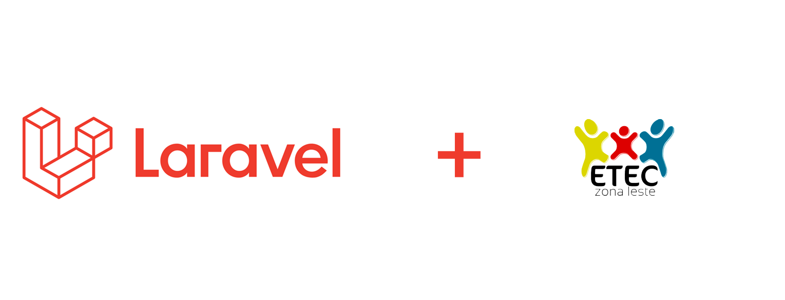

## Sobre / About
#### PTBR
Projeto de PW3 para aprender MVC com o framework Laravel usando a nuvem (Heroku) e o BD PostGree.
#### EN
WP3 project for learning MVC using the Laravel framework with Heroku Cloud and PostGree database.

## Como usar / Getting Started
#### PTBR
Baixe o projeto compactado pelo github e coloque no diretorio do xampp, também é possível começar se baixar o xampp e ir seguindo os pdf/html
#### EN
Download the zipped project in github and put it on xampp folder, also you can download xampp and follow the tutorials in the pdf/html files.

## Código de conduta / Conduct Code
#### PTBR
Para garantir que a comunidade do Laravel seja receptiva para todos, leia o [Code of Conduct](https://laravel.com/docs/contributions#code-of-conduct).
#### EN
In order to ensure that the Laravel community is welcoming to all, please review and abide by the [Code of Conduct](https://laravel.com/docs/contributions#code-of-conduct).

## Licença / License
#### PTBR
O framework laravel é um software open-source licenciado pelo MIT usando a [MIT license](https://opensource.org/licenses/MIT).
#### EN
The Laravel framework is open-sourced software licensed under the [MIT license](https://opensource.org/licenses/MIT).
